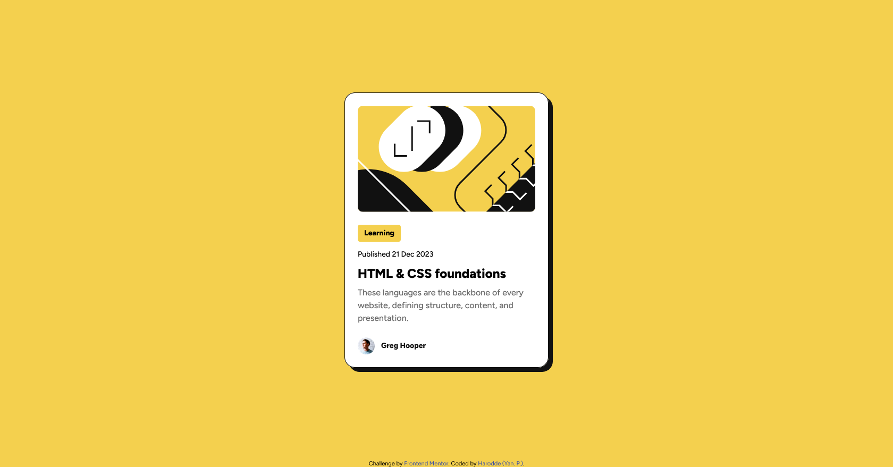

# Frontend Mentor - Blog preview card solution

This is a solution to the [Blog preview card challenge on Frontend Mentor](https://www.frontendmentor.io/challenges/blog-preview-card-ckPaj01IcS). Frontend Mentor challenges help you improve your coding skills by building realistic projects. 

## Table of contents

- [Overview](#overview)
  - [The challenge](#the-challenge)
  - [Screenshot](#screenshot)
  - [Links](#links)
- [My process](#my-process)
  - [Built with](#built-with)
  - [What I learned](#what-i-learned)
  - [Continued development](#continued-development)
  - [Useful resources](#useful-resources)
- [Author](#author)
- [Acknowledgments](#acknowledgments)

## Overview

### The challenge

Users should be able to:

- See hover and focus states for all interactive elements on the page

### Screenshot

)

### Links

- Solution URL: [GitHub](https://github.com/Harodde/frontendmentorProjectGit)
- Live Site URL: [GitHub Pages](https://harodde.github.io/frontendmentorProjectGit/)

## My process

### Built with

- Semantic HTML5 markup
- CSS custom properties 
- Flexbox
- Responsive without Media Queries (clamp)

### What I learned

Use this section to recap over some of your major learnings while working through this project. Writing these out and providing code samples of areas you want to highlight is a great way to reinforce your own knowledge.

To see how you can add code snippets, see below:

```
css
:root {
		...
		
        --font-small: clamp(12px, 1.2vw, 14px);
        /* Entre 12px et 14px selon la taille de l'écran */
        --font-medium: clamp(14px, 2vw, 16px);
        /* Entre 14px et 16px */
        --font-large: clamp(20px, 4vw, 24px);
        /* Entre 20px et 24px */
    }

.card {
		...
		width: fit-content;
		height: fit-content;
}

```

### Continued development

In the future, I want to explore using a CSS preprocessor like Sass to organize styles more efficiently. Improve my skill about responsive.

### Useful resources

- [ChatGPT](https://chat.openai.com) – Was a useful resource for clarifying CSS concepts and solving specific development issues.
- [Resource 2](https://developer.mozilla.org/en-US/docs/Web/CSS/clamp) - This helped me about text responsive with clamp(). I really liked this pattern and will use it going forward.

## Author

- Portfolio : [My Portfolio](https://votre-portfolio.com) *(coming soon)*

- Frontend Mentor : [@Harodde](https://www.frontendmentor.io/profile/Harodde)
- Linkedin : [Yanick's Profile](https://www.linkedin.com/in/ypernet-1a2b3c4d/)

## Acknowledgments

Thank you to Frontend Mentor for this challenge, and to everyone who shares resources and helps in the community.
